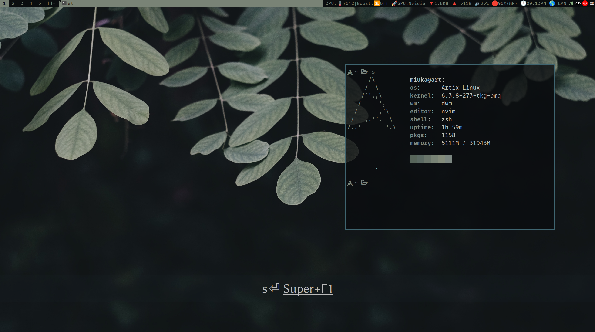

# my-dwm

My personal patched dwm

## Version

Based on dwm-6.5



## Patch List

The dependency package names are for arch-based distributions.

If you are not, the name may be different.

| Patch                      | Version  | Dependencies     |
| -------------------------- | -------- | ---------------- |
| dwm-actualfullscreen       | 20211013 | -                |
| dwm-alwayscenter           | 20200625 | -                |
| dwm-allowkillrule          | 6.4      | -                |
| dwm-aspectresize           | 6.2      | -                |
| dwm-cfacts-vanitygaps      | 6.4      | -                |
| dwm-dwmc                   | 6.2      | xorg-xsetroot    |
| dwm-fixborders             | 6.2      | -                |
| dwm-float-border-color     | 6.2      | -                |
| dwm-fullscreen-compilation | 6.3      | -                |
| dwm-hide_vacant_tags       | 6.3      | -                |
| dwm-layoutmenu             | 6.2      | xmenu xclickroot |
| dwm-moveresize             | 20221210 | -                |
| dwm-noborderselfickerfix   | 20220426 | -                |
| dwm-nextprev               | 1.0      | -                |
| dwm-pertag                 | 6.2      | -                |
| dwm-preserveonrestart      | 6.3      | -                |
| dwm-push_no_master         | 6.4      | -                |
| dwm-restartsig             | 20180523 | -                |
| dwm-stacker                | 6.2      | -                |
| dwm-statuscmd              | 20210405 | dwmblocks        |
| dwm-statuspadding          | 6.3      | -                |
| dwm-scratchpad             | 20221102 | -                |
| dwm-switchtotag            | 6.2      | -                |
| dwm-swallow                | 6.3      | libxcb xcb-util  |
| dwm-systray                | 6.4      | -                |
| dwm-steam                  | 6.2      | -                |
| dwm-togglefloatingcenter   | 20210807 | -                |
| dwm-winicon                | 6.3-v2.1 | imlib2           |
| dwm-xrdb                   | 6.4      | -                |

## Installation

build and install：

```sh
git clone https://github.com/MiuKaShi/miuka-dwm.git
cd miuka-dwm
make
sudo make clean install
```
